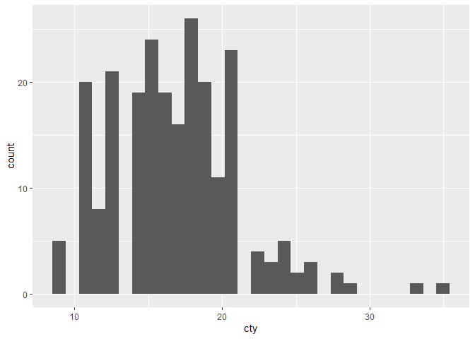
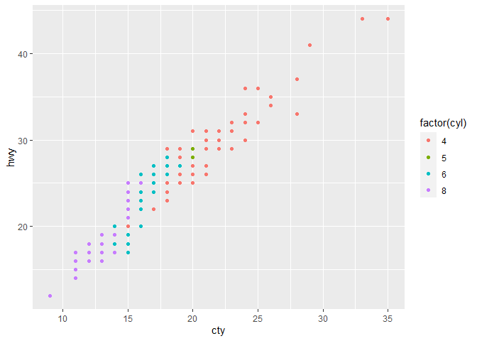

\#———————————————————- \# ggplot - Introduction to Graphical
Visualization \#———————————————————- \# \# 1. Basic Structure and syntax
in ggplot2 \# 2. Exploration in data structure (dimentsion and variables
properties) \# - Continous vs Discrete ? \# 3. Aesthetics definition \#
4. Primitive Plots (Horiontal line vs Vertical line) \# 5. One Varible
plot (geom\_histogram,geom\_bar) \# 5.1 Two varible plot (text, point,
jitter, box etc) \# 6. Cases study on Covid19 Data \#

``` r
library(ggplot2)

data <- mtcars
#Henderson and Velleman (1981), Building multiple regression models interactively. Biometrics, 37, 391â411.

dim(data)
```

    ## [1] 32 11

``` r
#32 11

str(data)
```

    ## 'data.frame':    32 obs. of  11 variables:
    ##  $ mpg : num  21 21 22.8 21.4 18.7 18.1 14.3 24.4 22.8 19.2 ...
    ##  $ cyl : num  6 6 4 6 8 6 8 4 4 6 ...
    ##  $ disp: num  160 160 108 258 360 ...
    ##  $ hp  : num  110 110 93 110 175 105 245 62 95 123 ...
    ##  $ drat: num  3.9 3.9 3.85 3.08 3.15 2.76 3.21 3.69 3.92 3.92 ...
    ##  $ wt  : num  2.62 2.88 2.32 3.21 3.44 ...
    ##  $ qsec: num  16.5 17 18.6 19.4 17 ...
    ##  $ vs  : num  0 0 1 1 0 1 0 1 1 1 ...
    ##  $ am  : num  1 1 1 0 0 0 0 0 0 0 ...
    ##  $ gear: num  4 4 4 3 3 3 3 4 4 4 ...
    ##  $ carb: num  4 4 1 1 2 1 4 2 2 4 ...

``` r
#[, 1]  mpg Miles/(US) gallon
#[, 2]  cyl Number of cylinders
#[, 3]  disp    Displacement (cu.in.)
#[, 4]  hp  Gross horsepower
#[, 5]  drat    Rear axle ratio
#[, 6]  wt  Weight (1000 lbs)
#[, 7]  qsec    1/4 mile time
#[, 8]  vs  Engine (0 = V-shaped, 1 = straight)
#[, 9]  am  Transmission (0 = automatic, 1 = manual)
#[,10]  gear    Number of forward gears
#[,11]  carb    Number of carburetors

#How ggplot works 
# 1. Define data 
# 2. Define aesthetic aes() 
# 3. Define variables, x= ; y =
```

\#Example

``` r
a <- ggplot(data, aes(x=gear,y=mpg)) 
a <- a + geom_blank() + ylim(0,35) + xlim(0,5)
a <- a + geom_hline(yintercept = 25)
a <- a + geom_vline(xintercept = 4)
a <- a + geom_abline(intercept=10,slope=5)
a 
```

<!-- -->

``` r
#----------------------------------------------------------
# One Variable
#----------------------------------------------------------
mpg <- mpg 

dim(mpg)
```

    ## [1] 234  11

``` r
#234 11

str(mpg)
```

    ## tibble [234 x 11] (S3: tbl_df/tbl/data.frame)
    ##  $ manufacturer: chr [1:234] "audi" "audi" "audi" "audi" ...
    ##  $ model       : chr [1:234] "a4" "a4" "a4" "a4" ...
    ##  $ displ       : num [1:234] 1.8 1.8 2 2 2.8 2.8 3.1 1.8 1.8 2 ...
    ##  $ year        : int [1:234] 1999 1999 2008 2008 1999 1999 2008 1999 1999 2008 ...
    ##  $ cyl         : int [1:234] 4 4 4 4 6 6 6 4 4 4 ...
    ##  $ trans       : chr [1:234] "auto(l5)" "manual(m5)" "manual(m6)" "auto(av)" ...
    ##  $ drv         : chr [1:234] "f" "f" "f" "f" ...
    ##  $ cty         : int [1:234] 18 21 20 21 16 18 18 18 16 20 ...
    ##  $ hwy         : int [1:234] 29 29 31 30 26 26 27 26 25 28 ...
    ##  $ fl          : chr [1:234] "p" "p" "p" "p" ...
    ##  $ class       : chr [1:234] "compact" "compact" "compact" "compact" ...

``` r
#http://archive.ics.uci.edu/ml/datasets/Auto+MPG
#tibble [234 x 11] (S3: tbl_df/tbl/data.frame)
#$ manufacturer: chr [1:234] "audi" "audi" "audi" "audi" ...
#$ model       : chr [1:234] "a4" "a4" "a4" "a4" ...
#$ displ       : num [1:234] 1.8 1.8 2 2 2.8 2.8 3.1 1.8 1.8 2 ...
#$ year        : int [1:234] 1999 1999 2008 2008 1999 1999 2008 1999 1999 2008 ...
#$ cyl         : int [1:234] 4 4 4 4 6 6 6 4 4 4 ...
#$ trans       : chr [1:234] "auto(l5)" "manual(m5)" "manual(m6)" "auto(av)" ...
#$ drv         : chr [1:234] "f" "f" "f" "f" ...
#$ cty         : int [1:234] 18 21 20 21 16 18 18 18 16 20 ...
#$ hwy         : int [1:234] 29 29 31 30 26 26 27 26 25 28 ...
#$ fl          : chr [1:234] "p" "p" "p" "p" ...
#$ class       : chr [1:234] "compact" "compact" "compact" "compact" ...

#One Discreate Parameters
b <- ggplot(mpg, aes(fl))
b <- b + geom_bar() 
b
```

<!-- -->

``` r
#One Continous Parameters
c <- ggplot(mpg, aes(cyl))
c <- c +  geom_histogram()
c
```

    ## `stat_bin()` using `bins = 30`. Pick better value with `binwidth`.

<!-- -->

``` r
d <- ggplot(mpg, aes(cty))
d <- d +  geom_histogram()
d
```

    ## `stat_bin()` using `bins = 30`. Pick better value with `binwidth`.

<!-- -->

``` r
#----------------------------------------------------------
# Two Variables
#----------------------------------------------------------

#continuous x , continuous y 
e <- ggplot(mpg, aes(cty, hwy))

e + geom_point()
```

<!-- -->

``` r
e + geom_jitter() 
```

<!-- -->

``` r
e + geom_label(aes(label = cty)) 
```

<!-- -->

``` r
e + geom_label(aes(label = hwy)) 
```

<!-- -->

``` r
e + geom_text(aes(label = cty))
```

<!-- -->

``` r
#discrete x , continuous y
f <- ggplot(mpg, aes(class, hwy))

f + geom_boxplot()
```

<!-- -->

``` r
f + geom_violin(scale = "area")
```

<!-- -->

``` r
#discrete x , discrete y 
g <- ggplot(mpg, aes(class, drv))
g + geom_count()
```

<!-- -->

``` r
#----------------------------------------------------------
# Two Variables (x and y), more variebles as gropuing
#----------------------------------------------------------

e <- ggplot(mpg, aes(cty, hwy))
e + geom_text(aes(label = cty))
```

<!-- -->

``` r
e + geom_text(aes(label = cty,colour = factor(manufacturer)))  
```

<!-- -->

``` r
e + geom_point(aes(colour = factor(cyl)))
```

<!-- -->

``` r
e + geom_point(aes(colour = factor(manufacturer)))
```

<!-- -->

``` r
e + geom_point(aes(colour = factor(manufacturer),shape = factor(cyl)))
```

<!-- -->

``` r
e + geom_jitter(aes(colour = factor(manufacturer), shape = factor(cyl), size = displ))
```

<!-- -->

\#———————————————————- \# Practical Data Plotting - Covid 19
\#———————————————————-
\#<https://www.ecdc.europa.eu/en/publications-data/download-todays-data-geographic-distribution-covid-19-cases-worldwide>

``` r
library(utils)
COVID_19 <-  read.csv("https://opendata.ecdc.europa.eu/covid19/casedistribution/csv", na.strings = "", fileEncoding = "UTF-8-BOM")

#1. Comparison between different countries, using a line plot (x = time, y=number of cases in log10). 
#2. Total new cases in the world in a stack column plot, with each country as its own color (x = MOnth, y = number of cases in log10)

dim(COVID_19)
```

    ## [1] 9791   10

``` r
#11768    10

str(COVID_19)
```

    ## 'data.frame':    9791 obs. of  10 variables:
    ##  $ dateRep                                        : chr  "11/01/2021" "04/01/2021" "28/12/2020" "21/12/2020" ...
    ##  $ year_week                                      : chr  "2021-01" "2020-53" "2020-52" "2020-51" ...
    ##  $ cases_weekly                                   : int  675 902 1994 740 1757 1672 1073 1368 1164 606 ...
    ##  $ deaths_weekly                                  : int  71 60 88 111 71 137 68 69 61 24 ...
    ##  $ countriesAndTerritories                        : chr  "Afghanistan" "Afghanistan" "Afghanistan" "Afghanistan" ...
    ##  $ geoId                                          : chr  "AF" "AF" "AF" "AF" ...
    ##  $ countryterritoryCode                           : chr  "AFG" "AFG" "AFG" "AFG" ...
    ##  $ popData2019                                    : int  38041757 38041757 38041757 38041757 38041757 38041757 38041757 38041757 38041757 38041757 ...
    ##  $ continentExp                                   : chr  "Asia" "Asia" "Asia" "Asia" ...
    ##  $ notification_rate_per_100000_population_14.days: num  4.15 7.61 7.19 6.56 9.01 7.22 6.42 6.66 4.65 3.7 ...

``` r
library(dplyr)
```

    ## 
    ## Attaching package: 'dplyr'

    ## The following objects are masked from 'package:stats':
    ## 
    ##     filter, lag

    ## The following objects are masked from 'package:base':
    ## 
    ##     intersect, setdiff, setequal, union

``` r
Totalcases_in_All_Countries <- COVID_19 %>% group_by(countriesAndTerritories) %>% summarise(Cases = sum(cases_weekly))
```

    ## `summarise()` ungrouping output (override with `.groups` argument)

\#1. Comparison between different countries, using a line plot (x =
time, y=number of cases in log10).

``` r
cv <- ggplot(COVID_19, aes(x = dateRep, y= cases_weekly)) 
cv + geom_jitter()
```

<!-- -->

``` r
cv + geom_jitter() + scale_y_log10()
```

    ## Warning in self$trans$transform(x): NaNs produced

    ## Warning: Transformation introduced infinite values in continuous y-axis

    ## Warning: Removed 7 rows containing missing values (geom_point).

<!-- -->

\#2. Total cases in the world in a stack column plot, with each country
as its own color (x = MOnth, y = number of cases in log10)

``` r
cv + geom_col(aes(color=countryterritoryCode)) 
```

<!-- -->

``` r
cv + geom_col(aes(color=countryterritoryCode))  +  theme(legend.position = "none")
```

<!-- -->

``` r
cv + geom_col(aes(color=countryterritoryCode)) + scale_y_log10() +  theme(legend.position = "none")
```

    ## Warning in self$trans$transform(x): NaNs produced

    ## Warning: Transformation introduced infinite values in continuous y-axis

    ## Warning: Removed 7 rows containing missing values (position_stack).

    ## Warning: Removed 1299 rows containing missing values (geom_col).

<!-- -->

``` r
COVID_19s <-  COVID_19 %>% group_by(countryterritoryCode) %>% filter(sum(cases_weekly)>300000)

cv2 <- ggplot(COVID_19s, aes(x = dateRep, y= cases_weekly)) 
cv2 + geom_col(aes(fill=countryterritoryCode)) 
```

<!-- -->

``` r
cv2 + geom_col(aes(fill=countryterritoryCode)) + scale_y_log10()
```

    ## Warning in self$trans$transform(x): NaNs produced

    ## Warning: Transformation introduced infinite values in continuous y-axis

    ## Warning: Removed 1 rows containing missing values (position_stack).

    ## Warning: Removed 160 rows containing missing values (geom_col).

<!-- -->
